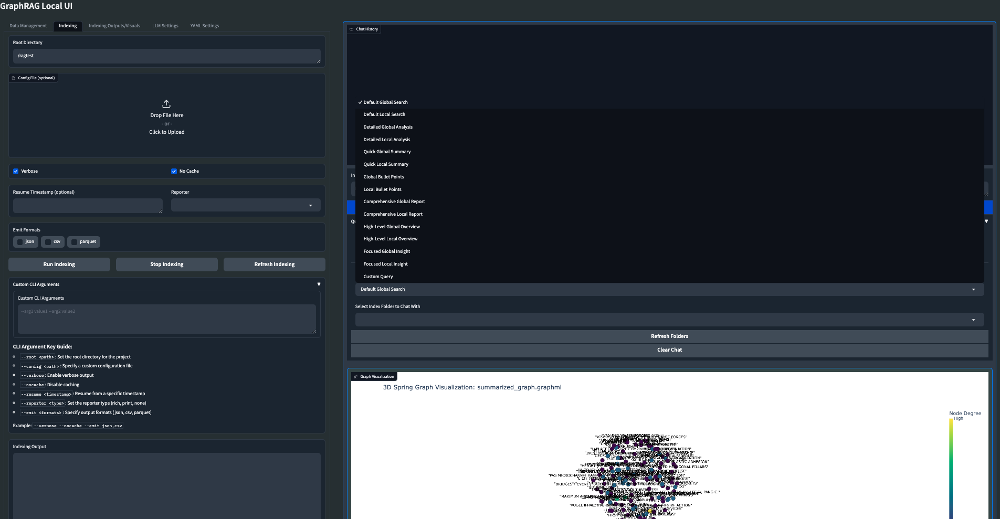

#  🕸️ GraphRAG Local

Welcome to **GraphRAG Local with Index/Prompt-Tuning and Querying/Chat UIs**! This project is an adaptation of Microsoft's [GraphRAG](https://github.com/microsoft/graphrag), tailored to support local models and featuring a comprehensive interactive user interface ecosystem. 

## 📄 Research Paper

For more details on the original GraphRAG implementation, please refer to the [GraphRAG paper](https://arxiv.org/pdf/2404.16130).

## 🌟 Features

- **API-Centric Architecture:** A robust FastAPI-based server (`api.py`) serving as the core of the GraphRAG operations.
- **Dedicated Indexing and Prompt Tuning UI:** A separate Gradio-based interface (`index_app.py`) for managing indexing and prompt tuning processes.
- **Local Model Support:** Leverage local models for LLM and embeddings, including compatibility with Ollama and OpenAI-compatible APIs.
- **Cost-Effective:** Eliminate dependency on costly cloud-based models by using your own local models.
- **Interactive UI:** User-friendly interface for managing data, running queries, and visualizing results (main app).
- **Real-time Graph Visualization:** Visualize your knowledge graph in 2D or 3D using Plotly (main app).
- **File Management:** Upload, view, edit, and delete input files directly from the UI.
- **Settings Management:** Easily update and manage your GraphRAG settings through the UI.
- **Output Exploration:** Browse and view indexing outputs and artifacts.
- **Logging:** Real-time logging for better debugging and monitoring.
- **Flexible Querying:** Support for global, local, and direct chat queries with customizable parameters (main app).
- **Customizable Visualization:** Adjust graph layout, node sizes, colors, and more to suit your preferences (main app).



## 🗺️ Roadmap

### **Important Note:** *Updates have been slow due to the day job and lack of immediate time, but I promise I am working on errors/issues in the background when able to. Please feel free to contribute/create a PR if you want to help out and find a great solution to an issue presented.* 
**The GraphRAG Local UI ecosystem is currently undergoing a major transition. While the main app remains functional, I am actively developing separate applications for Indexing/Prompt Tuning and Querying/Chat, all built around a robust central API. Users should expect some changes and potential instability during this transition period.**

*While it is currently functional, it has only been primarily tested on a Mac Studio M2.*

My vision for the GraphRAG Local UI ecosystem is to become the ultimate set of tools for working with GraphRAG and local LLMs, incorporating as many cool features and knowledge graph tools as possible. I am continuously working on improvements and new features.

### Recent Updates
- [x] New API-centric architecture (`api.py`)
- [x] Dedicated Indexing and Prompt Tuning UI (`index_app.py`)
- [x] Improved file management and output exploration
- [x] Background task handling for long-running operations
- [x] Enhanced configuration options through environment variables and YAML files

### Upcoming Features
- [ ] Dedicated Querying/Chat UI that interacts with the API
- [ ] Dockerfile for easier deployment
- [ ] Launch your own GraphRAG API server for use in external applications
- [ ] Experimental: Mixture of Agents for Indexing/Query of knowledge graph
- [ ] Support for more file formats (CSV, PDF, etc.)
- [ ] Web search/Scraping capabilities
- [ ] Advanced graph analysis tools
- [ ] Integration with popular knowledge management tools
- [ ] Collaborative features for team-based knowledge graph building

I am committed to making the GraphRAG Local UI ecosystem the most comprehensive and user-friendly toolset for working with knowledge graphs and LLMs. Your feedback and suggestions are much needed in shaping the future of this project.

Feel free to open an Issue if you run into an error, and I will try to address it as soon as possible to minimize any downtime you might experience.

---

## 📦 Installation and Setup

Follow these steps to set up and run the GraphRAG Local UI ecosystem:

1. **Create and activate a new conda environment:**
    ```bash
    conda create -n graphrag-local -y
    conda activate graphrag-local
    ```

2. **Install the required packages:**

    First install the GraphRAG dir from this repo (has changes not present in the Microsoft repo):

    ```bash
    pip install -e ./graphrag
    ```

    Then install the rest of the dependencies:

    ```bash
    pip install -r requirements.txt
    ```

3. **Launch the API server:**
    ```bash
    python api.py --host 0.0.0.0 --port 8012 --reload
    ```

4. **If using Ollama for embeddings, launch the embedding proxy:**
    ```bash
    python embedding_proxy.py --port 11435 --host http://localhost:11434
    ```
    Note: For detailed instructions on using Ollama embeddings with GraphRAG, refer to the EMBEDDING_PROXY_README.md file.

5. **Launch the Indexing and Prompt Tuning UI:**
    ```bash
    gradio index_app.py
    ```

6. **Launch the main interactive UI (legacy app):**
    ```bash
    gradio app.py
    ```
    or
    ```bash
    python app.py
    ```

7. **Access the UIs:**
    - Indexing and Prompt Tuning UI: Open your web browser and navigate to `http://localhost:7861`
    - Main UI (legacy): Open your web browser and navigate to `http://localhost:7860`

---

## 🚀 Getting Started with GraphRAG Local

GraphRAG is designed for flexibility, allowing you to quickly create and initialize your own indexing directory. Follow these steps to set up your environment:

### 1. Create the Indexing Directory

This repo comes with a pre-made Indexing folder but you may want to make your own, so here are the steps. First, create the required directory structure for your input data and indexing results:

```bash
mkdir -p ./indexing/input
```

This directory will store:
- Input .txt files for indexing
- Output results
- Prompts for Prompt Tuning

### 2. Add Sample Data (Optional)

If you want to start with sample data, copy it to your new input directory:

```bash
cp input/* ./indexing/input
```

You can also add your own .txt files to this directory for indexing.

### 3. Initialize the Indexing Folder

Run the following command to initialize the ./indexing folder with the required files:

```bash
python -m graphrag.index --init --root ./indexing
```

### 4. Configure Settings

Move the pre-configured `settings.yaml` file to your indexing directory:

```bash
mv settings.yaml ./indexing
```

This file contains the main configuration, pre-set for use with local models.

### 5. Customization

You can customize your setup by modifying the following environment variables:
- `ROOT_DIR`: Points to your main indexing directory
- `INPUT_DIR`: Specifies the location of your input files

### 📚 Additional Resources

For more detailed information and advanced usage, refer to the [official GraphRAG documentation](https://microsoft.github.io/graphrag/posts/get_started/).

---

## 🖥️ GraphRAG Application Ecosystem

The GraphRAG Local UI ecosystem consists of three main components, each serving a specific purpose in the knowledge graph creation and querying process:

### 1. Core API (`api.py`)

The `api.py` file serves as the backbone of the GraphRAG system, providing a robust FastAPI-based server that handles all core operations.

Key features:
- Manages indexing and prompt tuning processes
- Handles various query types (local, global, and direct chat)
- Integrates with local LLM and embedding models
- Provides endpoints for file management and system configuration

Usage:
```bash
python api.py --host 0.0.0.0 --port 8012 --reload
```

Note: If using Ollama for embeddings, make sure to run the embedding proxy (`embedding_proxy.py`) alongside `api.py`. Refer to the EMBEDDING_PROXY_README.md for detailed instructions.

### 2. Indexing and Prompt Tuning UI (`index_app.py`)

#### Workflow Integration

1. Start the Core API (`api.py`) to enable backend functionality.
2. If using Ollama for embeddings, start the embedding proxy (`embedding_proxy.py`).
3. Use the Indexing and Prompt Tuning UI (`index_app.py`) to prepare your data and fine-tune the system.
4. (Optional) Use the Main Interactive UI (`app.py`) for visualization and legacy features.

This modular approach allows for greater flexibility and easier maintenance of the GraphRAG system. As development continues, the functionality of `app.py` will be gradually integrated into new, specialized interfaces that interact with the core API.

### 2. Indexing and Prompt Tuning UI (`index_app.py`)

The `index_app.py` file provides a user-friendly Gradio interface for managing the indexing and prompt tuning processes.

Key features:
- Configure and run indexing tasks
- Set up and execute prompt tuning
- Manage input files and explore output data
- Adjust LLM and embedding settings

Usage:
```bash
python index_app.py
```
Access the UI at `http://localhost:7861`

### 3. Main Interactive UI (Legacy App) (`app.py`)

The `app.py` file is the pre-existing main application, which is being phased out but still provides useful functionality.

Key features:
- Visualize knowledge graphs in 2D or 3D
- Run queries and view results
- Manage GraphRAG settings
- Explore indexed data

Usage:
```bash
python app.py
```
or
```bash
gradio app.py
```
Access the UI at `http://localhost:7860`

### Workflow Integration

1. Start the Core API (`api.py`) to enable backend functionality.
2. Use the Indexing and Prompt Tuning UI (`index_app.py`) to prepare your data and fine-tune the system.
3. (Optional) Use the Main Interactive UI (`app.py`) for visualization and legacy features.

This modular approach allows for greater flexibility and easier maintenance of the GraphRAG system. As development continues, the functionality of `app.py` will be gradually integrated into new, specialized interfaces that interact with the core API.

---

## 📚 Citations

- Original GraphRAG repository by Microsoft: [GraphRAG](https://github.com/microsoft/graphrag)
- This project took inspiration and used the GraphRAG4OpenWebUI repository by win4r (https://github.com/win4r/GraphRAG4OpenWebUI) as a starting point for the API implementation.

---

## Troubleshooting

- If you encounter any issues with the new API or Indexing UI, please check the console logs for detailed error messages.
- For the main app, if you can't run `gradio app.py`, try running `pip install --upgrade gradio` and then exit out and start a new terminal. It should then load and launch properly as a Gradio app.
- On Windows, if you run into an encoding/UTF error, you can change it to the correct format in the YAML Settings menu.

For any issues or feature requests, please open an issue on the GitHub repository. Happy knowledge graphing!
