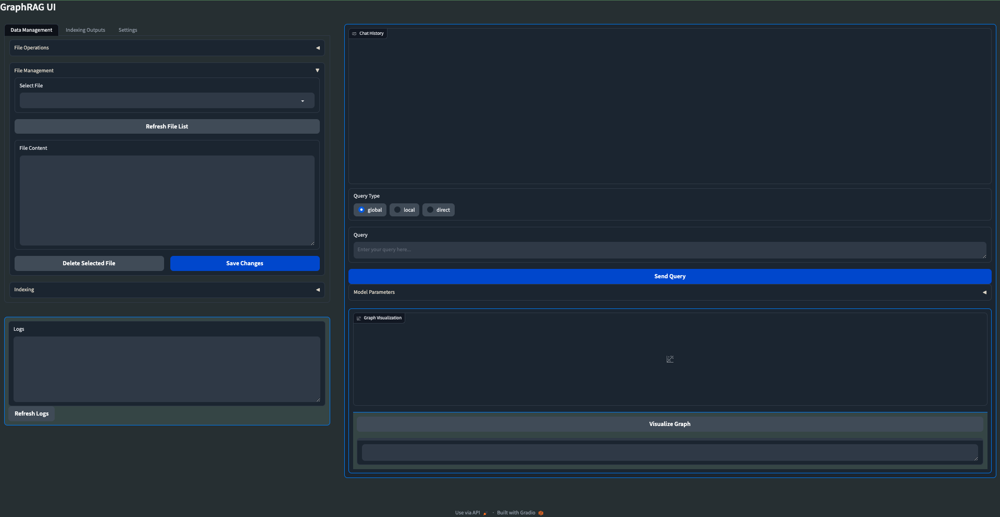

#  🕸️ GraphRAG Local with Ollama and Gradio UI

Welcome to **GraphRAG Local with Ollama and Interactive UI**! This is an adaptation of Microsoft's [GraphRAG](https://github.com/microsoft/graphrag), tailored to support local models using Ollama and featuring a new interactive user interface.

*NOTE: The app gained traction much quicker than I anticipated so I am working to get any found bugs fixed and suggested improvements integrated. Right now it is fully functional, tested only on my Mac Studio M2 though. 

The next update is a major refactor and overall improvement in all the areas so it has unfortunately taken a bit longer than expected. I am trying to be fluid with the adjustments and so will try to update as often as possible. 

Changes being made right now and tested:

- LLM agnostic: Use Ollama or set your own base URL and local model for LLM and Embedder
- Launch your own GraphRAG API server so you can use the functions in your own external app
- Dockerfile for easier deployment
- Experimental: Mixture of Agents for Indexing/Query of knowledge graph
- Custom configurable graph visuals
- Preset Query/Indexing library options to quickly and easily harness all the GraphRAG args
- More file formats (CSV, PDF, etc)
- Web search/Scraping

Feel free to open an Issue if you run into an error and I will try to address it ASAP so you don't run into any downtime*

## 📄 Research Paper

For more details on the original GraphRAG implementation, please refer to the [GraphRAG paper](https://arxiv.org/pdf/2404.16130).

## 🌟 Features

- **Local Model Support:** Leverage local models with Ollama for LLM and embeddings.(I highly recommend using the 'sciphi/triplex' Ollama model for Indexing your data) ('ollama pull sciphi/triplex')
- **Cost-Effective:** Eliminate dependency on costly OpenAI models.
- **Interactive UI:** User-friendly interface for managing data, running queries, and visualizing results.
- **Real-time Graph Visualization:** Visualize your knowledge graph in 3D using Plotly.
- **File Management:** Upload, view, edit, and delete input files directly from the UI.
- **Settings Management:** Easily update and manage your GraphRAG settings through the UI.
- **Output Exploration:** Browse and view indexing outputs and artifacts.
- **Logging:** Real-time logging for better debugging and monitoring.



## 📦 Installation and Setup

Follow these steps to set up and run GraphRAG Local with Ollama and Interactive UI:

1. **Create and activate a new conda environment:**
    ```bash
    conda create -n graphrag-ollama -y
    conda activate graphrag-ollama
    ```

2. **Install Ollama:**
    Visit [Ollama's website](https://ollama.com/) for installation instructions.

4. **Install the required packages:**
    ```bash
    pip install -r requirements.txt
    ```

4. **Launch the interactive UI:**
    ```bash
    gradio app.py
    ```
    or

    ```bash
    python app.py
    ```

6. **Using the UI:**
    - Once the UI is launched, you can perform all necessary operations through the interface.
    - This includes initializing the project, managing settings, uploading files, running indexing, and executing queries.
    - The UI provides a user-friendly way to interact with GraphRAG without needing to run command-line operations.

Note: The UI now handles all the operations that were previously done through command-line instructions, making the process more streamlined and user-friendly.

## 🛠️ Customization

Users can experiment by changing the models in the `settings.yaml` file. The LLM model expects language models like llama3, mistral, phi3, etc., and the embedding model section expects embedding models like mxbai-embed-large, nomic-embed-text, etc., which are provided by Ollama. You can find the complete list of models provided by Ollama [here](https://ollama.com/library).

## 📊 Visualization

The UI now includes a 3D graph visualization feature. To use it:

1. Run indexing on your data
2. Go to the "Indexing Outputs" tab
3. Select the latest output folder and navigate to the GraphML file
4. Click the "Visualize Graph" button

## 📚 Citations

- Original GraphRAG repository by Microsoft: [GraphRAG](https://github.com/microsoft/graphrag)
- Ollama: [Ollama](https://ollama.com/)

---
