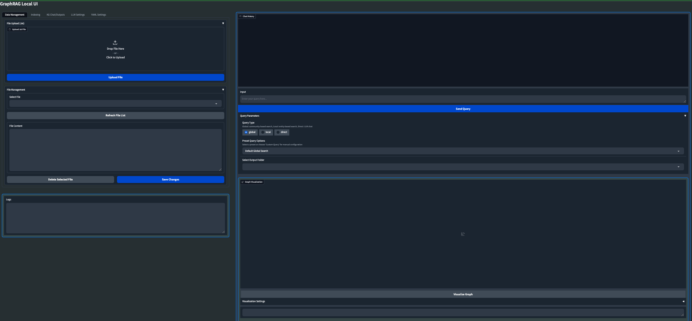

#  🕸️ GraphRAG Local with Interactive UI

Welcome to **GraphRAG Local with Interactive UI**! This is an adaptation of Microsoft's [GraphRAG](https://github.com/microsoft/graphrag), tailored to support local models and featuring a comprehensive interactive user interface.

## 📄 Research Paper

For more details on the original GraphRAG implementation, please refer to the [GraphRAG paper](https://arxiv.org/pdf/2404.16130).

## 🌟 Features

- **Local Model Support:** Leverage local models for LLM and embeddings, including compatibility with Ollama and OpenAI-compatible APIs.
- **Cost-Effective:** Eliminate dependency on costly cloud-based models by using your own local models.
- **Interactive UI:** User-friendly interface for managing data, running queries, and visualizing results.
- **Real-time Graph Visualization:** Visualize your knowledge graph in 2D or 3D using Plotly.
- **File Management:** Upload, view, edit, and delete input files directly from the UI.
- **Settings Management:** Easily update and manage your GraphRAG settings through the UI.
- **Output Exploration:** Browse and view indexing outputs and artifacts.
- **Logging:** Real-time logging for better debugging and monitoring.
- **Flexible Querying:** Support for global, local, and direct chat queries with customizable parameters.



## 🗺️ Roadmap

**Important Note:** GraphRAG Local UI is currently a major work in progress and building a UI around the GraphRAG library has introduced a number of challenges; mainly with the Indexing process. As I strive to make the application more stable with local LLMs, users should expect to encounter some bugs and breaking changes. I appreciate your patience and feedback during this development phase.

*The app gained traction much quicker than anticipated, so we are actively working to fix bugs and integrate suggested improvements. While it is currently functional, it has been primarily tested on a Mac Studio M2.*

My vision for GraphRAG Local UI is to become the ultimate GraphRAG app for local LLMs, incorporating as many cool features and knowledge graph tools as possible. I am continuously working on improvements and new features.

### Recent Updates
- [x] LLM agnostic: Use Ollama or set your own base URL and local model for LLM and Embedder
- [x] Custom configurable graph visuals
- [x] Preset Query/Indexing library options to quickly and easily harness all the GraphRAG args

### Upcoming Features
- [ ] Dockerfile for easier deployment
- [ ] Launch your own GraphRAG API server for use in external applications
- [ ] Experimental: Mixture of Agents for Indexing/Query of knowledge graph
- [ ] Support for more file formats (CSV, PDF, etc.)
- [ ] Web search/Scraping capabilities
- [ ] Enhanced error handling and user feedback
- [ ] Improved performance and scalability
- [ ] Advanced graph analysis tools
- [ ] Integration with popular knowledge management tools
- [ ] Collaborative features for team-based knowledge graph building

I am committed to making GraphRAG Local UI the most comprehensive and user-friendly tool for working with knowledge graphs and LLMs. Your feedback and suggestions are much needed in shaping the future of this project.

Feel free to open an Issue if you run into an error, and we will try to address it as soon as possible to minimize any downtime you might experience.

## 📦 Installation and Setup

Follow these steps to set up and run GraphRAG Local with Interactive UI:

1. **Create and activate a new conda environment:**
    ```bash
    conda create -n graphrag-local -y
    conda activate graphrag-local
    ```

2. **Install the required packages:**
    ```bash
    pip install -r requirements.txt
    ```

3. **Launch the interactive UI:**
    ```bash
    gradio app.py
    ```

    or

    ```bash
    python app.py
    ```

4. **Access the UI:**
    Open your web browser and navigate to `http://localhost:7860` to access the GraphRAG Local UI.

## 🖥️ Using the GraphRAG Local UI

### Data Management

1. **File Upload:**
   - Navigate to the "Data Management" tab.
   - Use the "File Upload" section to upload .txt files to the input directory.

2. **File Management:**
   - View, edit, and delete uploaded files in the "File Management" section.
   - Use the "Refresh File List" button to update the list of available files.

### Indexing

1. **Configure Indexing:**
   - Go to the "Indexing" tab.
   - Set the root directory (default is "./ragtest").
   - Optionally upload a config file.
   - Adjust other parameters like verbosity, caching, and output formats.

2. **Run Indexing:**
   - Click "Run Indexing" to start the indexing process.
   - Monitor progress in real-time through the output box and progress bar.
   - Use "Stop Indexing" if you need to halt the process.

### KG Chat/Outputs

1. **Explore Indexed Data:**
   - Select an output folder from the dropdown.
   - Browse through the folder contents and view file information and content.

2. **Visualize Graph:**
   - Select a GraphML file from the output folder.
   - Click "Visualize Graph" to generate a 2D or 3D visualization of your knowledge graph.
   - Customize the visualization using the "Visualization Settings" accordion.

### LLM Settings

1. **Configure LLM and Embeddings:**
   - Set API base URLs and keys for both LLM and embeddings.
   - Choose the service type (OpenAI-compatible or Ollama).
   - Select models from the dropdown or refresh the list.

2. **Adjust Parameters:**
   - Set the system message, context window, temperature, and max tokens.
   - Click "Update LLM Settings" to save your changes.

### Querying

1. **Choose Query Type:**
   - Select between global, local, or direct chat queries.

2. **Select Preset or Custom Options:**
   - Choose a preset query option or customize your query parameters.

3. **Enter Your Query:**
   - Type your query in the input box and click "Send Query" or press Shift+Enter.

4. **View Results:**
   - See the chat history and responses in the chat interface.

### Other Settings

- Adjust additional GraphRAG settings in the "YAML Settings" tab as needed.

## 🛠️ Customization

Users can experiment with different models and settings:

- For OpenAI-compatible APIs: Use any model compatible with the OpenAI API format.
- For Ollama: Use models like llama2, mistral, phi-2, etc. Find the complete list of Ollama models [here](https://ollama.com/library).

## 📊 Visualization

The UI includes a 2D/3D graph visualization feature:

1. Run indexing on your data.
2. Go to the "KG Chat/Outputs" tab.
3. Select the latest output folder and navigate to the GraphML file.
4. Click the "Visualize Graph" button.
5. Customize the visualization using the settings provided.

## 🚀 Advanced Usage

- **Custom CLI Arguments:** In the query interface, advanced users can add custom CLI arguments for more granular control over the query process.

## 📚 Citations

- Original GraphRAG repository by Microsoft: [GraphRAG](https://github.com/microsoft/graphrag)

---

## Troubleshooting

- If you can't run `gradio app.py`, try running `pip install --upgrade gradio` and then exit out and start a new terminal. It should then load and launch properly as a Gradio app

- On Windows, if you run into and encoding/UTF error, you can change it to the correct format in the YAML Settings menu

- Indexing Errors: These are still tough to debug a track down as it is dependant on your specific pipeline of llms and embedders. Right now it seems to call /v1/embeddings no matter what in the Index workflow, but I think I found a workaround that allows Ollama and other local options. I'll keep trying to reenforce the Indexing process to make it more stable and robust.

For any issues or feature requests, please open an issue on the GitHub repository. Happy knowledge graphing!